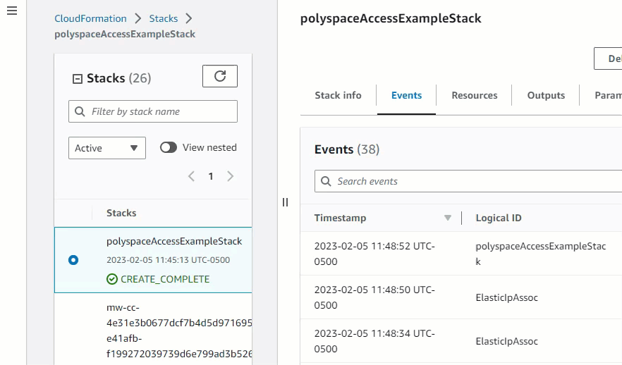
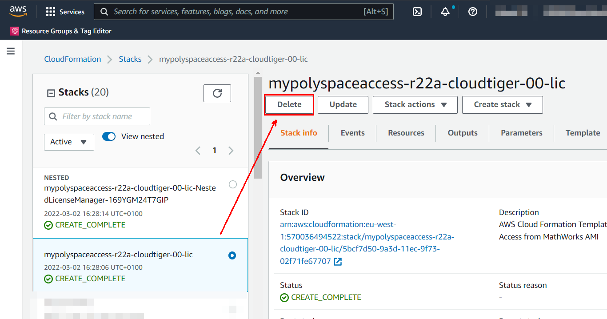
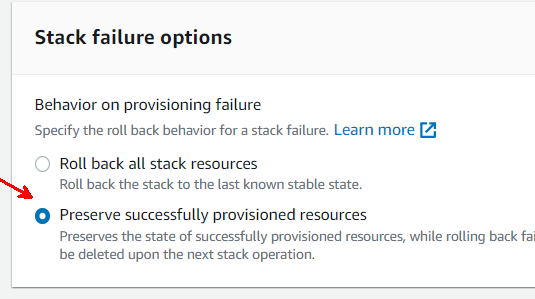

# Polyspace Access on Amazon Web Services (Linux VM)

## Step 1. Launch the Template

Click the **Launch Stack** button for your region to deploy the cloud resources on AWS. This opens an AWS **Create stack** page in your web browser.
> **Note:** To complete the remaining steps more easily, keep these instructions open in a separate window.

| Region | Launch Link |
| --------------- | ----------- |
| eu-west-1 |  |
| us-east-1 |  |
| ap-south-1 |  |

## Step 2. Configure and Deploy on the Cloud Resources
Fill out the parameter fields on the "**Create stack**" page.

### General Parameters
|||
|---|---|
|**Stack name**| Name that will be shown in the AWS CloudFormation console. Specify a name that is unique within the AWS account.|

### Amazon EC2 Configuration
| Parameter | Description |
|---        |---          |
| **Instance type** | The AWS EC2 instance type to use for the Polyspace Access server.  `t3a.xlarge` is recommended for small and medium-sized usage scenarios, and `t3a.2xlarge` for more than 20 users.  For a list of instance types, see [Amazon EC2 Instance Types](https://aws.amazon.com/ec2/instance-types). Check that the instance is available in the Availability Zone of the first subnet in the configured list.|
| **Size of database volume (GB)** | The size in GB of the EBS volume to use for the database where you store analysis and review data. A blank volume is created during initial deployment.  Specify a size large enough to store the expected amount of data. |
| **Backup data volume automatically** | Set to `yes` to create weekly snapshots of the EBS volume using the AWS Backup service. Note that this incurs storage costs. Snapshots are created with a retention policy of one week. |
| **Name of SSH keypair** | The name of an existing EC2 KeyPair to allow SSH access to all the instances. For instructions on how to create keypairs, See https://docs.aws.amazon.com/AWSEC2/latest/UserGuide/ec2-key-pairs.html. |

### Network Configuration
| Parameter | Description |
| --------------- | ----------- |
| **Availability Zone to deploy this stack to** | Name of availability zone where EC2 instance and volume will be deployed.|
| **VPC to deploy this stack to** | ID of an existing virtual private cloud (VPC) in which to deploy this stack. |
| **Subnets for Polyspace Access instance** | List of existing subnets IDs for Access |
| **CIDR IP address range of admin user** | The IP address range that is allowed to manage the Polyspace Access service (start, stop, SSH) from outside of the VPC. Enter the IP address in the format `<ip_address>/<mask>`, For instance 10.0.0.1/32.  To find your IP address, search for 'what is my ip address' on the web.  The mask determines the number of IP addresses to include. A mask of 32 is a single IP address. To build a specific range, use this [CIDR to IPv4 Conversion](https://www.ipaddressguide.com/cidr) calculator. You might need to contact your IT administrator to determine which IP address is appropriate. |
| **CIDR IP address range of end users** | The IP address range that is allowed to connect to the Polyspace Access web interface from outside of the VPC. Enter the IP address in the format `<ip_address>/<mask>`, For instance 10.0.0.1/32.  To find your IP address, search for 'what is my ip address' on the web.  The mask determines the number of IP addresses to include. A mask of 32 is a single IP address. To build a specific range, use this [CIDR to IPv4 Conversion](https://www.ipaddressguide.com/cidr) calculator. You might need to contact your IT administrator to determine which IP address is appropriate. |

### Polyspace Service Configuration
| Parameter       | Description |
| --------------- | ----------- |
| **Users to create** | Enter a space-separated list of usernames to create. Random passwords will are generated for each user.  If you launch the stack with an existing volume, this setting is ignored and the existing users are used instead. |

### Polyspace License Configuration
| Parameter       | Description |
| --------------- | ----------- |
| **Create license manager?** | Set this parameter to `yes` to create a new license server with a license manager. If you already have a license manager, set this setting to `no` and specify the **Existing license manager connection string**.|
| **New license manager password** | Specify a password to access the license manager dashboard. This field cannot be empty if you create a license manager. |
| **Confirm new license manager password** | Re-enter password.|
| **Existing license manager connection string** | If you use an existing license manager, specify its address in the format `<port>@<hostname>`, for instance `27000@ip-123-45-67-89.ec2.internal`.  The license manager must be accessible from the selected VPC and subnet. If you deployed a license manager using the `license-manager-for-matlab-on-aws` reference architecture, you can make this license manager accessible by specifying its security group as the **AdditionalSecurityGroup** parameter.|

### Next Steps
Click **Next**, configure optional stack options, and click **Next** again to review your parameter configuration. Scroll to the bottom of the page and select the boxes to acknowledge that the template uses IAM roles. These IAM roles allow the AWS CloudFormation to:
  * Share secret information between with the admin, via the S3 bucket.
  * Write the SSL certificate to the S3 bucket for secure access.
  
Click **Submit** to start the deployment of Polyspace Access on the cloud. The **Stack Details** page for your stack opens and you can view the creation status for the various stack resources. The process typically takes 5 to 10 minutes, even if the status of the stack creation is `CREATE_COMPLETE`. The delay is due to the boot time for Polyspace Access.  
 To check that the process is complete, go to the **Outputs** tab and click the **BucketURL**. The S3 bucket page shows file `admin.txt` on the **Objects** tab.

  
  
The file `admin.txt` contains administrative details such as the initial login credentials for the admin and other users. It is recommended that the admin change the passwords after the first login via **User Manager** interface. You open this interface by clicking the **AccessURLAdmin** on the **Outputs**  tab.

## Step 3. Manage Licenses
If you selected `yes` for the template setting **Create license manager?**, follow these steps to complete the license setup:
 1. Select the Polyspace Access stack in the **CloudFormation Stacks** window.
 2. On the  **Outputs** tab, click the **LicenseManagerURL** link to open the License Manager Dashboard.
 3. Follow these [instructions](https://github.com/mathworks-ref-arch/license-manager-for-matlab-on-aws/blob/master/releases/R2024b/README.md#step-3-connect-to-the-dashboard). Use the password you entered in the **New license manager password** setting.

If you use an existing license server, check that the specified license server has the license increments and options file for Polyspace Access in place. For more information, see [Manage Polyspace Licenses](https://www.mathworks.com/help/releases/R2024b/bugfinder/manage-polyspace-access-license.html).

## Step 4. Test your Polyspace Access Installation
Once you complete the previous steps, users can login into and start using Polyspace Access immediately. Provide users with the following:
* The Polyspace Access URL. You can find the URL (**AccessURL**) on the **Outputs** tab of the CloudFormation **Stack details** page.
* The user login credentials. You can find the credentials in the `admin.txt` file on the S3 bucket page. To open this page, click the `BucketURL` on the **Outputs** tab of the CloudFormation **Stack details** page.  
If you launched Polyspace Access using an existing volume, use the login information stored on that volume.

To customize the configuration to match the requirements of your company or team (for instance, to use your company LDAP to authenticate user logins), open the **User Manager** interface. To open the interface, click the **AccessURLAdmin** on the **Outputs** tab of the CloudFormation **Stack details** page. The initial password to log into the **User Manager** is available in the file `admin.txt`.

## Step 5. Customize your Installation
The template provided my MathWorks creates only a basic setup. For production use, it is recommended that you change some settings. For example:
  * Use certificates signed by a certificate authority (CA) instead of self-signed certificates.
  * Use your company LDAP to manage user authentications.
  * Integrate Polyspace Access with a bug tracking tool such as Jira or redmine.

You can find instructions in the [product documentation](https://www.mathworks.com/help/releases/R2024b/bugfinder/install-polyspace-access.html).

> :information_source: All user data, including settings and customizations, are stored on the database volume. When you update Polyspace Access, this volume and the data stored on it are preserved.

## (Optional) Connect Polyspace Desktop to Polyspace Access on Cloud
You can configure a Polyspace desktop interface running on your local machine to communicate with the Polyspace Access instance. Once you complete this configuration, from your local Polyspace desktop, you can:
* Open the Polyspace Access interface.
* Open and manage analysis results stored on Polyspace Access.
* Upload analysis results to Polyspace Access.

In a typical configuration, an admin user performs some of the configuration steps, and an end user completes the remaining steps. This table shows the steps performed by each user role.

|Role  | Steps |
|----- |---    |
| Cloud admin user| 1. Click the **BucketURL** on the **Outputs** tab of the CloudFormation **Stack details** page. 2. On the S3 bucket page, select the certificate file **self-cert.pem** and click **Download**. 3. Copy the downloaded certificate to the local machine. Use a utility such as `scp` to transfer the file securely.|
| End user|1. Use the certificate file that the admin copied to your machine to [generate a client keystore](https://www.mathworks.com/help/releases/R2024b/polyspace_access/install/register-polyspace-desktop-user-interface.html#mw_b703a5a4-a34c-4ebc-82f9-f66c54d120d2). 2. Open the Polyspace desktop interface and follow these [instructions](https://www.mathworks.com/help/releases/R2024b/polyspace_access/install/register-polyspace-desktop-user-interface.html) to complete the configuration.|

# Additional Information

## Port Requirements for Polyspace Access
The CloudFormation template automatically manages the server-side ports. To communicate with the server from a client machine, check that the client machine allows outgoing communication on the ports specifed in this table. You might need to update your firewall settings to complete this step.

| Required ports                | Description                                                                           |
| ----------------------------- | ------------------------------------------------------------------------------------- |
| TCP 9443                      | HTTPS access to the web interface                                                     |
| TCP 22                        | SSH access to the EC2 instance (admins only)|

## Backups/Snapshots
The creation of database backups on a regular basis is strongly recommended. You can enable automatic backups when the template is instantiated. The AWS backup service creates one EBS snapshot weekly, on Saturday evenings. 
> :warning: Enabling this option may incur additional cost, such as for storing the snapshot data.

If you do not enable automatic backups when you instantiate the template, you can use the `stack update` function to enable it even after creating the stack.  
Alternatively, you can create your own backup schedule using the [AWS Backup Service](https://aws.amazon.com/getting-started/hands-on/amazon-ebs-backup-and-restore-using-aws-backup/).

## Monitoring
By default, the template does not set up any health monitoring.

## Upgrade Polyspace Access
This section describes how to upgrade to a newer version of Polyspace Access. This process also updates the underlying operating system.

>:warning: Before updating, check that you have a snapshot of the EBS data volume. See [Backups/Snapshots](#backupssnapshots).

1. Go to the CloudFormation console, select the stack of the current release, and click the **Accessnode** link on the **Resources** tab.
2. On the following page, select the EC2 instance and click `Stop instance` from the **Instance State** list.
3. On the same page, go to the **Storage** tab, click the database volume (`/dev/sdh`), and then select **Actions** > **Detach volume**.
4. Return to the  CloudFormation console, select the stack for the current release, and click **Update**.
5. On the **Update stack** page, select **Replace current template**, and provide the path to the JSON template for the new release.
6. Check the parameters (no change should be necessary) but do not yet Execute the template.
7. Click **view change set**. It should show two resources:
    * AWS::EC2::Instance: Replacement=True
    * AWS::EC2::EIPAttachment: Replacement: Conditional
8. Execute the change set and wait until it the event log shows `UPDATE_COMPLETE`.

>**Note:** The upgrade process generates a new password to log into the Admin interface. To view the new password, open the `admin.txt` file on the S3 bucket page. The file `admin.txt` is overwritten during the upgrade process. To view the previous version of the file, use the versioning feature of the S3 bucker.

If you encounter issues with this process, you can roll back by re-attaching the EBS volume to the stopped instance and then re-start the instance. Contact [MathWorks Technical Support](https://www.mathworks.com/support/contact_us.html) for additional help.

## Delete Your Cloud Resources

>:warning: Deleting the stack also deletes the database with your project data. To retain the database, create a snapshot of the volume before deletion.  If you want to upgrade while retaining your data, then use the **Update** function as described in the previous section.

You can delete the CloudFormation stack and all associated resources and data when you are done with them. This action cannot be undone. This action also deletes the nested license manager stack if you created one.  

To delete the CloudFormation:
1. Select the Stack in the CloudFormation Stacks screen. Click **Delete**.

    

2. Confirm if prompted. CloudFormation deletes your resources. The operation might take a few minutes.

## Troubleshooting
* If the stack creation fails, check the **Events** tab of the CloudFormation console. Scroll through the list of resources to find which resources caused the failure and why.  To allow debugging, check the box **Preserve successfully provisioned resources** in the section **Stack failure options** during stack creation:

  

* If the stack was created successfully but you are unable to connect to the services, check the logs in the admin web interface (**Outputs** > **AccessURLAdmin**).

* If you are an admin and you need to use SSH to connect to the instance, login as user `ubuntu` using this command:
    ~~~css
    ssh -i privateKeyPath ubuntu@serverURL
    ~~~
    Here:
    * `privateKeyPath` is the path to the private key you generated when creating the EC2 keypair.
    * `serverURL` is the public DNS name of the Polyspace Access instance. To get the DNS name, see [get information about your instance](https://docs.aws.amazon.com/AWSEC2/latest/UserGuide/connection-prereqs.html#connection-prereqs-get-info-about-instance).
